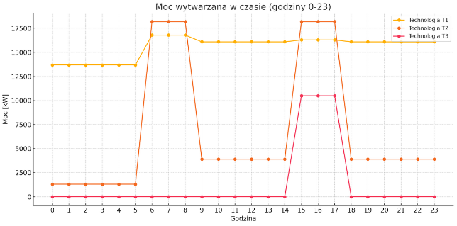

# **WDWR - Projekt**
Bartosz Zaborowski 319996

## Zadanie 1
W pierwszym zadaniu należało rozwiązać problem minimalizacji całkowitego kosztu oczekiwanego generowanego podczas pracy elektrowni. Jako, że całkowity koszt oczekiwany, związany jest ze zmienną losową $\textbf{R}$, jedynie poprzez równania liniowe, mogliśmy skorzystać z następującej zależności:
$$\mathbb{E}(Koszt(\textbf{R})) = Koszt(\mathbb{E}(\textbf{R}))$$
gdzie:
- $\textbf{R}$ $\rightarrow$ zmienna losowa
- $\textbf{E}$ $\rightarrow$ wartość oczekiwana

Ponieważ, znamy rozkład zmiennej $\textbf{R}$, możemy obliczyć jej wartość oczeiwaną. Do wygenerowania wyników posłużył mi skrypt w języku "R" zapisany w pliku `zad1_data_generate.r`.

Otrzymane wyniki: 

$\mathbb{E}(\textbf{R}_1)=2.65067 \\
\mathbb{E}(\textbf{R}_2)=2.909694 \\
\mathbb{E}(\textbf{R}_3)=3.07852$

Wygenerowane wyniki zostały zapisane z wykorzystaniem formatu, z którego korzysta AMPL, w pliku `zadanie_1.dat`

### Założenia, które przyjąłem:
- Generator T1 może działać wyłącznie gdy równocześnie działa z nim T2 lub T3
- Generatory muszą zaspokoić nie tylko zapotrzebowanie, ale też ewentualny wzrost do 10% (czyli zabezpieczenie na wypadek skoku popytu).
- Łączna produkcja nie może przekroczyć sumy maksymalnych mocy generatorów.

 ### Zmienne decyzyjne: 
- $h\in [0, 1, 2, 3,..23]$ $\rightarrow$ zakres godzin
- $t\in\{1, 2, 3\}$ $\rightarrow$ generatory 
- **$x_{ht} \in \mathbb{N}_0$** $\rightarrow$ liczba aktywnych generatorów $t$ działających w godzinie $h$
- **$q_{ht} \in [0, \infty)$** $\rightarrow$ łączna moc wytwarzana przez generatory $t$ w godzinie $h$ [MW] (obciążenie generatorów)
- **$u_{ht} \in \mathbb{N}_0$** $\rightarrow$ liczba generatorów $t$ uruchomionych w godzinie $h$
- **$v_{ht} \in \mathbb{N}_0$** $\rightarrow$ liczba generatorów $t$ wyłączonych w godzinie $h$

**Zmienne pomocnicze:**
- $m_{ht}$ – łączna moc (obciążenie) generatorów typu $t$ o godzinie $h$ [MW]
- $d_{h}$ – zapotrzebowanie na moc (popyt) o godzinie $h$ [MW]
- $a_{t}$ – liczba dostępnych generatorów typu $t$
- $\text{min}_{t}$ – minimalne obciążenie pojedynczego generatora typu $t$ [MW]
- $\text{max}_{t}$ – maksymalne obciążenie pojedynczego generatora typu $t$ [MW]
- $\delta$ – dopuszczalny procentowy wzrost zapotrzebowania (np. 0.1 dla 10%)
- $\text{prev}(h)$ – poprzednia godzina względem $h$, czyli $h-1$ (godzina poprzedzająca)
- $z_{ht} \in \{0, 1\}$ — zmienna decyzyjna binarna wskazująca, czy generatory typu $t$ są aktywne w godzinie $h$ (1 = włączone, 0 = wyłączone).

**Założenia dotyczące zmiennych decyzyjnych**

Wszystkie zmienne decyzyjne muszą przyjmować wartości nieujemne, co odzwierciedla rzeczywiste ograniczenia fizyczne i operacyjne systemu:

- $x_{ht} \in \mathbb{N}_0$ — liczba pracujących generatorów typu $t$ w godzinie $h$ (nieujemna liczba całkowita),  
- $u_{ht} \in \mathbb{N}_0$ — liczba generatorów typu $t$ uruchomionych w godzinie $h$ (nieujemna liczba całkowita),  
- $v_{ht} \in \mathbb{N}_0$ — liczba generatorów typu $t$ wyłączonych w godzinie $h$ (nieujemna liczba całkowita),  
- $q_{ht} \in \mathbb{R}_{\geq 0}$ — moc generowana przez generatory typu $t$ w godzinie $h$ [MW] (nieujemna liczba rzeczywista).

Formalnie zapisujemy:

$$
x_{ht} \geq 0, \quad u_{ht} \geq 0, \quad v_{ht} \geq 0, \quad q_{ht} \geq 0 \quad \forall h \in H, \quad \forall t \in T.
$$

Takie założenie gwarantuje poprawność modelu i sensowność fizyczną wyników optymalizacji.

### Ograniczenia modelu

W poniższym modelu przyjęto następujące ograniczenia:

1. **Powiązanie liczby aktywnych generatorów z ich użyciem (górna granica):**  
Jeśli generator typu $t$ nie został użyty w godzinie $h$, to liczba aktywnych egzemplarzy tego typu musi wynosić 0.  

$$
x_{ht} \leq a_t \cdot z_{ht} \quad \forall h, t
$$

2. **Powiązanie liczby aktywnych generatorów z ich użyciem (dolna granica):**  
Jeśli generator został użyty, to musi działać przynajmniej jeden egzemplarz.  

$$
x_{ht} \geq z_{ht} \quad \forall h, t
$$

3. **Implikacja użycia T1 → (T2 ∨ T3):**  
Jeśli w danej godzinie $h$ został użyty generator typu T1, to co najmniej jeden z generatorów typu T2 lub T3 również musi być użyty.  

$$
z_{h,\text{T2}} + z_{h,\text{T3}} \geq z_{h,\text{T1}} \quad \forall h
$$

4. **Minimalna moc produkowana przez aktywne generatory:**  
Każdy aktywny generator musi pracować z mocą nie mniejszą niż minimalne obciążenie danego typu.  

$$
q_{ht} \geq x_{ht} \cdot \text{min}_t \quad \forall h, t
$$

5. **Pokrycie zapotrzebowania:**  
Suma mocy wytwarzanej przez wszystkie generatory w każdej godzinie musi równać się zapotrzebowaniu.  

$$
\sum_{t} q_{ht} = d_h \quad \forall h
$$

6. **Zapas mocy (rezerwa):**  
Łączna maksymalna możliwa moc wszystkich aktywnych generatorów musi zapewniać rezerwę mocy na wypadek wzrostu zapotrzebowania.  

$$
\sum_{t} x_{ht} \cdot \text{max}_t \geq (1 + \delta) \cdot d_h \quad \forall h
$$

7. **Górna granica mocy generatorów**

	Moc wytwarzana przez generatory typu t w godzinie h nie może przekroczyć maksymalnej mocy dostępnej przy liczbie aktywnych generatorów:

$$
\forall h \in \{0, \dots, 23\}, \quad \forall t \in \{1, 2, 3\} : \quad
q_{ht} \leq x_{ht} \cdot \text{max}_t
$$

8. **Limit dostępnych generatorów:**  
Liczba pracujących generatorów nie może przekraczać liczby dostępnych jednostek danego typu.  

$$
x_{ht} \leq a_t \quad \forall h, t
$$

9. **Zmiana stanu generatorów:**  
Zmiana liczby aktywnych generatorów pomiędzy kolejnymi godzinami to różnica między uruchomionymi a wyłączonymi jednostkami.  

$$
x_{ht} = x_{\text{prev}(h),t} + u_{ht} - v_{ht} \quad \forall h > 0, t
$$

 
### Funkcja celu:

Celem optymalizacji jest **minimalizacja całkowitych kosztów eksploatacji** systemu generacji energii elektrycznej w horyzoncie doby.

Funkcję celu zapisujemy jako:

$$
\min \quad \text{Koszt}_{\text{całkowity}} = \sum_{h \in H} \sum_{t \in T} \left[
u_{ht} \cdot K^{\text{start}}_t
+ x_{ht} \cdot K^{\text{stała}}_t
+ \left( q_{ht} - x_{ht} \cdot \text{min}_t \right) \cdot K^{\text{dodatkowa}}_t
\right]
$$

gdzie:
- $h \in H = \{0, 1, \dots, 23\}$ — indeks godzin doby,  
- $t \in T = \{1, 2, 3\}$ — typ generatora,  
- $u_{ht}$ — liczba generatorów typu $t$ uruchomionych o godzinie $h$,  
- $x_{ht}$ — liczba pracujących generatorów typu $t$ o godzinie $h$,  
- $q_{ht}$ — całkowita moc generowana przez wszystkie aktywne generatory typu $t$ w godzinie $h$ [MW],  
- $\text{min}_t$ — minimalne obciążenie jednego generatora typu $t$ [MW],  
- $K^{\text{start}}_t$ — koszt uruchomienia jednego generatora typu $t$,  
- $K^{\text{stała}}_t$ — koszt pracy jednego generatora typu $t$ niezależnie od obciążenia,  
- $K^{\text{dodatkowa}}_t$ — koszt jednostkowy (za 1 MW) dodatkowej mocy powyżej minimum dla typu $t$.  

Uwagi:
- Składnik $(q_{ht} - x_{ht} \cdot \text{min}_t)$ reprezentuje moc powyżej minimalnego obciążenia, która generuje **dodatkowe koszty eksploatacyjne**.

### Analiza wyników:
Celem modelu była minimalizacja całkowitych kosztów pracy trzech typów generatorów (T1, T2, T3) w horyzoncie dobowym (24 godziny), przy zapewnieniu pokrycia zapotrzebowania na moc w każdej godzinie. Model uwzględniał ograniczenia techniczne (minimalna i maksymalna liczba jednostek, moce, koszty uruchomienia) oraz przełączania jednostek.

Model osiągnął wartość funkcji celu równą 820 260.829, co oznacza minimalny koszt wytworzenia energii przy spełnieniu wszystkich warunków technicznych i zapotrzebowania.

#### Praca poszczególnych typów generatorów:
Generator T1:
- Pracował przez całą dobę – był używany w każdej godzinie
- Zawsze posiadał generator pracujący z nim równocześnie w danej godzinie
- Liczba pracujących jednostek:
	- godziny 0–5: 13 jednostek,
	- godziny 6–23: 16 jednostek.
- Moc wytwarzana wzrosła z 13 700 MW do 16 800 MW o godzinie 6:00, a następnie ustabilizowała się na poziomie ~16 100 MW.

Można wnioskować więc, że T1 pełni rolę stabilnego źródła bazowego, najprawdopodobniej o najniższych kosztach jednostkowych pracy.

Generator T2:
- Również aktywny przez całą dobę
- Działał w dwóch trybach:
	- godziny 0–5 i 9–14 oraz 18–23: 1 lub 3 jednostki (niska produkcja: 1300–3900 MW),
	- godziny 6–8 i 15–17: 14 jednostek (wysoka produkcja: 18 200 MW).

Z perspektywy rozwiązania, T2 pełni funkcję elastycznego źródła uzupełniającego, dostosowując się do okresów zwiększonego zapotrzebowania.

Generator T3:
- Pracował wyłącznie w godzinach 15–17.
- Uruchomiono 7 jednostek, co daje produkcję 10 500 MW.
- Pozostawał wyłączony przez resztę doby.

T3 jest źródłem szczytowym, uruchamianym jedynie w okresie największego zapotrzebowania. Model unika jego użycia poza tym okresem, co sugeruje wysokie koszty eksploatacji lub uruchomienia.

Suma mocy wytwarzanej przez wszystkie typy generatorów w każdej godzinie pokrywa zapotrzebowanie (założenie modelu). W godzinach szczytu (15–17) konieczne było włączenie T3, co potwierdza skuteczne działanie modelu w zakresie zapewnienia ciągłości zasilania. Model ogranicza liczbę przełączeń, co wpływa pozytywnie na minimalizację kosztów oraz potencjalnie ogranicza eksploatację generatorów.

Poniżej tabele z rozkładem ilości pracujących generatorów oraz wytwarzanej mocy w stosunku do godzin:

**Liczba pracujących:**
| godzina | T1 | T2 | T3 |
|--------:|---:|---:|---:|
|       0 | 13 |  1 |  0 |
|       1 | 13 |  1 |  0 |
|       2 | 13 |  1 |  0 |
|       3 | 13 |  1 |  0 |
|       4 | 13 |  1 |  0 |
|       5 | 13 |  1 |  0 |
|       6 | 16 | 14 |  0 |
|       7 | 16 | 14 |  0 |
|       8 | 16 | 14 |  0 |
|       9 | 16 |  3 |  0 |
|      10 | 16 |  3 |  0 |
|      11 | 16 |  3 |  0 |
|      12 | 16 |  3 |  0 |
|      13 | 16 |  3 |  0 |
|      14 | 16 |  3 |  0 |
|      15 | 16 | 14 |  7 |
|      16 | 16 | 14 |  7 |
|      17 | 16 | 14 |  7 |
|      18 | 16 |  3 |  0 |
|      19 | 16 |  3 |  0 |
|      20 | 16 |  3 |  0 |
|      21 | 16 |  3 |  0 |
|      22 | 16 |  3 |  0 |
|      23 | 16 |  3 |  0 |

**Wytwarzana moc:**

| godzina |     T1 |     T2 |     T3 |
|--------:|-------:|-------:|-------:|
|       0 |  13700 |   1300 |      0 |
|       1 |  13700 |   1300 |      0 |
|       2 |  13700 |   1300 |      0 |
|       3 |  13700 |   1300 |      0 |
|       4 |  13700 |   1300 |      0 |
|       5 |  13700 |   1300 |      0 |
|       6 |  16800 |  18200 |      0 |
|       7 |  16800 |  18200 |      0 |
|       8 |  16800 |  18200 |      0 |
|       9 |  16100 |   3900 |      0 |
|      10 |  16100 |   3900 |      0 |
|      11 |  16100 |   3900 |      0 |
|      12 |  16100 |   3900 |      0 |
|      13 |  16100 |   3900 |      0 |
|      14 |  16100 |   3900 |      0 |
|      15 |  16300 |  18200 |  10500 |
|      16 |  16300 |  18200 |  10500 |
|      17 |  16300 |  18200 |  10500 |
|      18 |  16100 |   3900 |      0 |
|      19 |  16100 |   3900 |      0 |
|      20 |  16100 |   3900 |      0 |
|      21 |  16100 |   3900 |      0 |
|      22 |  16100 |   3900 |      0 |
|      23 |  16100 |   3900 |      0 |

#### Wnioski końcowe

Harmonogram pracy generatorów został zaplanowany w sposób optymalny, minimalizując koszty przy jednoczesnym spełnieniu ograniczeń technicznych i zapewnieniu ciągłości dostaw energii. Generator T1 działał jako źródło podstawowe, T2 jako uzupełniające, natomiast T3 jako źródło szczytowe. Taki podział pracy świadczy o poprawnym uwzględnieniu charakterystyki poszczególnych typów jednostek w modelu.

## Zadanie 2